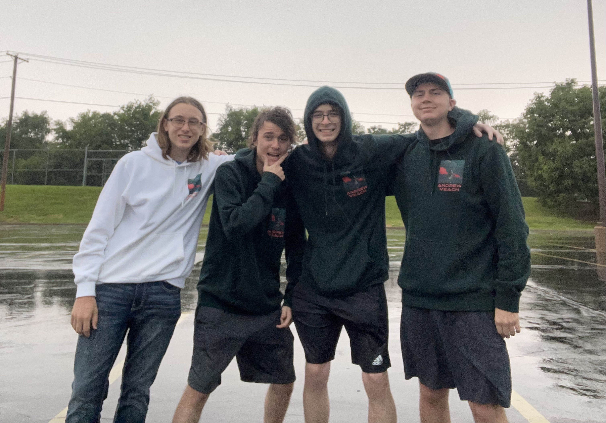

# Midterm Markdown Project
## Page Directory
- [Home](./README.md)
- [About Me](./ABOUTME.md)
- [My Friends](./FRIENDS.md)
- [Theory of Systematic Relativity](./THEORY.md)
- [Favorite Video Games](./VIDEOGAMES.md)
- [Favorite Composers](./COMPOSERS.md)
---

## My friends
### I got tired about writing about myself so I figured I would make this page about some of my friends.

## Carson
### He is from [Tennessee](https://en.wikipedia.org/wiki/Tennessee) and likes cars. 

## Chris
### He is also from Tennessee and likes frogs.

## Jackson
### He is also from Tennessee and like programming.


### Here is a picture of us
### From left to right: Jackson - Chris - Me - Carson
# Coding
```
friends_list = ['Carson', 'Chris', 'Jackson']
interest_list = ['cars', 'frogs', 'programming']

print(friends_list)

while True:
    friend = input("Which friend would you like to learn about? ")
    if friend in friends_list:
        interest = friends_list.index(friend)
        print(f"{friend} likes {interest_list[interest]}.")
        break
    else:
        print("Please choose one from the list provided.")
```